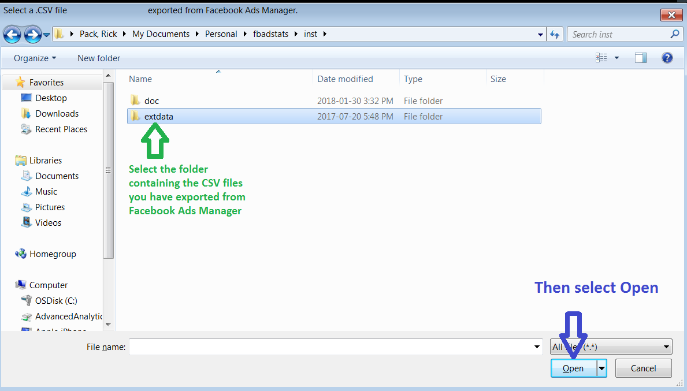
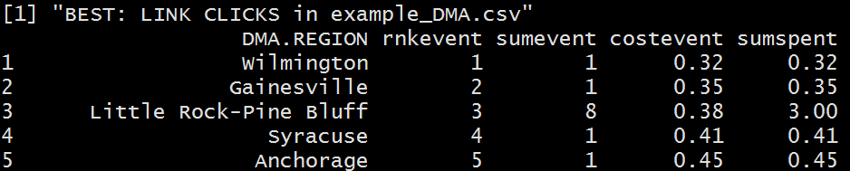

```{r, echo = FALSE}
knitr::opts_chunk$set(
  collapse = TRUE,
  comment = "#>",
  fig.path = "README-"
)
```

# FBadstats

R Package for generating statistics from Facebook ads performance data. Assists with ad targeting by aggregating data across multiple ad sets or campaigns in an attractive way. Works with many kinds of column selections from Facebook Ads Manager including Campaign, Ad Set, and Ad primary views. Currently only includes the breakdown Group analyzer function `FBadGstats`.  
*Disclaimer: This function and the entire `FBadstats` package are not supported or endorsed by Facebook, Inc. Only the user is responsible for its use.*

## Installation

First install the free (open-source) statistical software (and language) named "R" at:
[http://cran.rstudio.com/](http://cran.rstudio.com/)

Then download the most popular software to make using R easier, RStudio. The free version will be perfect. Scroll down and choose the appropriate installer under **Installers for Supported Platforms** at:
[https://www.rstudio.com/products/rstudio/download/](https://www.rstudio.com/products/rstudio/download/)

Open RStudio and you can now install the `FBadstats` package from github by entering the following in RStudio:
```{r gh-installation, eval = FALSE}
## This first package is to enable the install_github function
install.packages("devtools")
## Now we can always load that package with
library("devtools")
## Install FBadstats
devtools::install_github("RickPack/FBadstats")
```
## Easiest use - select a file or folder
The easiest use is to call the function, navigate to your exported CSV file and then select it. The default parameters may give you all you need.

### Call the function
```{r, message=FALSE, echo=FALSE}
## load the package
library(FBadstats)
```

```{r, message=FALSE, eval=FALSE}
FBadGstats()
```
### Select your file


### Use the output


You can select a folder and process all of the .CSV files with:
```{r, message=FALSE, eval=FALSE}
FBadGstats(choosedir="YES")
```
## Advanced usage - modifying parameters

### Advanced Example 1/3
```{r example1, fig.width = 10, fig.height = 4.5, fig.align = 'center'}
## Load FBadstats
library("FBadstats")
# Show only the best performing groups and include the graphical output
FBadGstats(filerd = "example_DMA.csv", grphout = "YES", tblout = "BEST")
```

### For A/B testing, use the `filtervar` and `filtervarneg` parameters. 
Here we see BOTH [default for tblout parameter] the top 3 and worst 3 Age / Gender groups in a comparison between where "6txt" did (parameter `filtervar` = "hotreg") and did not (parameter `filtervarneg` = "hotreg") appear in the ad set name.  
At least two events (clicks) must have occurred. Otherwise, an anomalous single event for 25-34 males caused that group to appear.  
"Hotreg" indicated where selected regions with a history of performing well were the only ones targeted with the advertisement.  

### Advanced Example 2/3
```{r example2, fig.width = 10, fig.height = 4.5, fig.align = 'center'}
FBadGstats(filerd = "example_PerfClk_AgeGender.csv", filtervar = 'hotreg',    printrow = 3, minevent = 2, grphout = "NO")
FBadGstats(filerd = "example_PerfClk_AgeGender.csv", filtervarneg = 'hotreg', printrow = 3, minevent = 2,   grphout = "NO")
```

### Advanced Example 3/3 (Assign FBadGstats call to a variable in order to explore the data outside of FBadGstats)
##### A list is returned so use [[1]] for breakdown groups and [[2]] for Campaign, Ad, or Ad Set, one of which being automatically detected based on the inputfile
```{r example3, fig.width = 10, fig.height = 4.5, fig.align = 'center'}
myfbfrm <- FBadGstats(filerd = "Example_AdsView_Region.csv", filtervar = 'Teach', grphout = "NO")
## What are all of the available ad set names?
# 1. First look at the column names in the data
colnames(myfbfrm)
# 2. Now we can use the unique function to see all of the available names and appropriately adjust the filtervar parameter
unique(myfbfrm$AD.NAME)
```

**Note**: See more examples by entering in RStudio:
```{r, eval = FALSE}
vignette(package = "FBadstats")
```

#### Acknowledgements
Thank you to [Brian Fannin](http://pirategrunt.com/blog/), [Ari Lamstein](https://www.arilamstein.com/blog/), and [Lucia Gjeltema](http://ncdata4good.github.io/UWchallenge/recap.html) for your feedback and encouragement.
