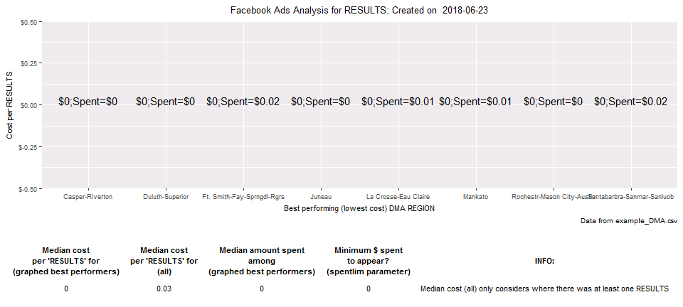

<!-- README.md is generated from README.Rmd. Please edit this file -->
FBadstats
=========

R Package for generating statistics from Facebook ads performance data. Currently only includes the breakdown Group analyzer function `fbadGstats`.

Installation
------------

First install the free (open-source) statistical software (and language) named "R" at: <http://cran.rstudio.com/>

Then download the most popular software to make using R easier, RStudio. The free version will be perfect. Scroll down and choose the appropriate installer under **Installers for Supported Platforms** at: <https://www.rstudio.com/products/rstudio/download/>

Open RStudio and you can now install the `FBadstats` package from github by entering the following in RStudio:

``` r
## This first package is to enable the install_github function
install.packages("devtools")
## Now we can always load that package with
library("devtools")
## Install FBadstats
devtools::install_github("RickPack/FBadstats")
```

Example 1/3
-----------

``` r
## Load FBadstats
library("FBadstats")
#> FB Ads Analysis tool: 'fbadGstats' - Breakdown Group analysis function
# Show only the best performing groups and include the graphical output
fbadGstats(filerd = "example_DMA.csv", grphout = "YES", tblout = "BEST")
#> [1] "-------------------------------------------------------------"
#> [1] "BEST: LINK CLICKS in example_DMA.csv"
#> NULL
#> [1] "Number of groups in all of data: 135"
#> [1] "Number of DMA REGION groups with at least one LINK CLICKS and minimum spend of $0 = 63"
#> [1] "Total amount spent: $320.47"
```

 \#\# For A:B comparison, use the filtervar parameter. \#\# Here we see BOTH \[default for tblout parameter\] the top 3 and worst 3 Age / Gender groups in a comparison between where "6txt" did and did not appear in the ad set name \#\# At least two events (clicks) must have occurred. Otherwise an anomalous single event for 25-34 males causes that group to appear. \#\# "Hotreg" indicated where selected regions with a history of performing well were the only ones targeted with the advertisement \#\# Example 2/3

``` r
fbadGstats(filerd = "example_PerfClk_AgeGender.csv", filtervar = 'hotreg',    prtrow = 3, minevent = 2, grphout = "NO")
#> [1] "-------------------------------------------------------------"
#> [1] "WORST: RESULTS in example_PerfClk_AgeGender.csv"
#> NULL
#> [1] "BEST: RESULTS in example_PerfClk_AgeGender.csv"
#> NULL
#> [1] "Number of groups in all of data: 6"
#> [1] "Number of AGE_GENDER groups with at least one RESULTS and minimum spend of $0 = 3"
#> [1] "Total amount spent: $125.76"
fbadGstats(filerd = "example_PerfClk_AgeGender.csv", filtervarneg = 'hotreg', prtrow = 3, minevent = 2,   grphout = "NO")
#> [1] "-------------------------------------------------------------"
#> [1] "WORST: RESULTS in example_PerfClk_AgeGender.csv"
#> NULL
#> [1] "BEST: RESULTS in example_PerfClk_AgeGender.csv"
#> NULL
#> [1] "Number of groups in all of data: 14"
#> [1] "Number of AGE_GENDER groups with at least one RESULTS and minimum spend of $0 = 5"
#> [1] "Total amount spent: $258.62"
```

Assign fbadGstats call to a variable in order to explore the data outside of fbadGstats
---------------------------------------------------------------------------------------

Example 3/3
-----------

``` r
myfbfrm <- fbadGstats(filerd = "example_PerfClk_AgeGender.csv", filtervar = 'AllPg', grphout = "NO")
#> [1] "-------------------------------------------------------------"
#> [1] "WORST: RESULTS in example_PerfClk_AgeGender.csv"
#> NULL
#> [1] "BEST: RESULTS in example_PerfClk_AgeGender.csv"
#> NULL
#> [1] "Number of groups in all of data: 5"
#> [1] "Number of AGE_GENDER groups with at least one RESULTS and minimum spend of $0 = 4"
#> [1] "Total amount spent: $18.37"
## What are all of the available ad set names?
# 1. First look at the column names in the data
colnames(myfbfrm)
#>  [1] "REPORTING.STARTS"              "REPORTING.ENDS"               
#>  [3] "AD.SET.NAME"                   "AGE_GENDER"                   
#>  [5] "DELIVERY"                      "RESULTS"                      
#>  [7] "RESULT.INDICATOR"              "REACH"                        
#>  [9] "FREQUENCY"                     "BUDGET"                       
#> [11] "BUDGET.TYPE"                   "AMOUNT.SPENT..USD."           
#> [13] "ENDS"                          "STARTS"                       
#> [15] "CLICKS..ALL."                  "CTR..ALL."                    
#> [17] "CPC..ALL...USD."               "IMPRESSIONS"                  
#> [19] "LINK.CLICKS"                   "CTR..LINK.CLICK.THROUGH.RATE."
#> [21] "CAMPAIGN.NAME"                 "BYGRPVAR"                     
#> [23] "S1"                            "V1"
# 2. Now we can use the unique function to see all of the available names and appropriately adjust the filtervar parameter
unique(myfbfrm$AD.SET.NAME)
#> [1] "ProBook_AllPg_75kAccSeLaneReg"
```

**Note**: See more examples by entering in RStudio:

``` r
vignette(package = "FBadstats")
```
