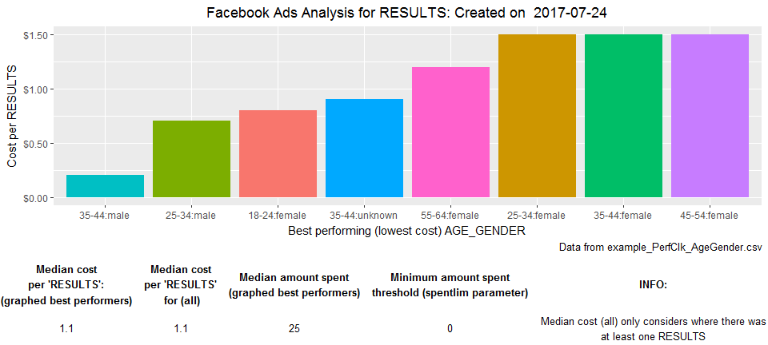

<!-- README.md is generated from README.Rmd. Please edit that file -->
fbadstats
=========

R Package for generating statistics from Facebook ads performance data Currently only includes the breakdown Group analyzer function `fbadGstats`

Installation
------------

First install the free (open-source) statistical software named "R" at: <http://cran.rstudio.com/>

Then download the most popular GUI for R, RStudio. The free version will be perfect. Scroll down and choose the appropriate installer under **Installers for Supported Platforms** at: <https://www.rstudio.com/products/rstudio/download/>

Open RStudio and you can now install the fbadstats package from github by entering the following in RStudio:

``` r
## This first package is to enable the install_github function
install.packages("devtools")
## Now we can always load that package with
library("devtools")
## Install fbadstats
devtools::install_github("RickPack/fbadstats")
```

Example
-------

**Note**: See more examples by entering in RStudio:

``` r
vignette(package = "fbadstats")
```

``` r
## Load fbadstats
library("fbadstats")
#> FB Ads Analysis tool: 'fbadGstats' - Breakdown analysis function!.
fbadGstats(filerd = "example_PerfClk_AgeGender.csv", grphout = "YES", tblout = "BEST")
#> [1] "--------------------------------------------------------------------------------------"
#> [1] "BEST: RESULTS in example_PerfClk_AgeGender.csv"
#>      AGE_GENDER rnkevt sumevt costevt sumspent
#>           <chr>  <int>  <dbl>   <dbl>    <dbl>
#> 1    35-44:male      1     11     0.2     2.34
#> 2    25-34:male      2      2     0.7     1.49
#> 3  18-24:female      3     10     0.8     8.42
#> 4 35-44:unknown      4      1     0.9     0.91
#> 5  55-64:female      5     34     1.2    40.84
#> 6  25-34:female      6     71     1.5   103.02
#> 7  35-44:female      6    108     1.5   164.20
#> 8  45-54:female      6     41     1.5    62.28
#> [1] "Number of regions in all of data: 14"
#> [1] "Number of AGE_GENDER groups with at least one RESULTS and minimum spend of $0 = 8"
#> [1] "Total amount spent: $384.38"
```


