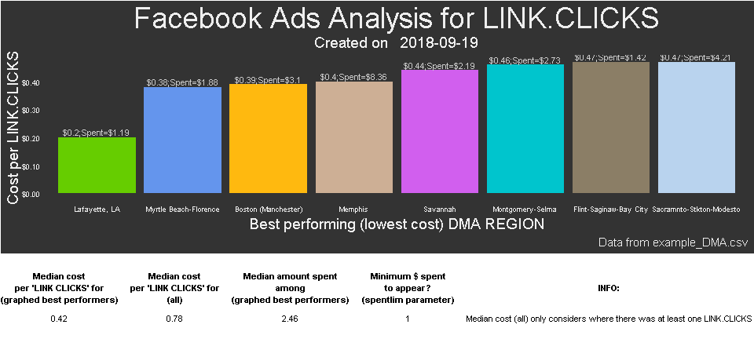

FBadstats
=========

R Package for generating statistics from Facebook ads performance data. Assists with ad targeting by aggregating data across multiple ad sets or campaigns in an attractive way. Currently only includes the breakdown Group analyzer function `fbadGstats`.
*Disclaimer: This function and the entire `FBadstats` package are not supported or endorsed by Facebook, Inc. Only the user is responsible for its use.*

Installation
------------

First install the free (open-source) statistical software (and language) named "R" at: <http://cran.rstudio.com/>

Then download the most popular software to make using R easier, RStudio. The free version will be perfect. Scroll down and choose the appropriate installer under **Installers for Supported Platforms** at: <https://www.rstudio.com/products/rstudio/download/>

Open RStudio and you can now install the `FBadstats` package from github by entering the following in RStudio:

``` r
## This first package is to enable the install_github function
install.packages("devtools")
## Now we can always load that package with
library("devtools")
## Install FBadstats
devtools::install_github("RickPack/FBadstats")
```

#### Easiest use - select a file or folder

The easiest use is to call the function, navigate to your exported CSV file and then select it. The default parameters may give you all you need. \#\# Call the function

    #> [1] "C:/Users/Packr1/Documents/Personal/fbadstats"

``` r
fbadGstats()
```

Select your file
----------------

 \#\# Use the output  You can select a folder and process all of the .CSV files with:

``` r
fbadGstats(choosedir="YES")
```

### Advanced Example 1/3

``` r
## Load FBadstats
library("FBadstats")
# Show only the best performing groups and include the graphical output
fbadGstats(filerd = "example_DMA.csv", grphout = "YES", tblout = "BEST")
#> [1] "-------------------------------------------------------------"
#> [1] "BEST: LINK CLICKS in example_DMA.csv"
#>                    DMA.REGION rnkevt sumevt costevt sumspent
#> 1                  Wilmington      1      1     0.3     0.32
#> 2                   Anchorage      2      1     0.4     0.45
#> 3                 Gainesville      2      1     0.4     0.35
#> 4      Little Rock-Pine Bluff      2      8     0.4     3.00
#> 5                    Syracuse      2      1     0.4     0.41
#> 6                  Cincinnati      6      7     0.5     3.57
#> 7        El Paso (Las Cruces)      6      1     0.5     0.54
#> 8                   Knoxville      6      1     0.5     0.48
#> 9   Tampa-St. Pete (Sarasota)      6      7     0.5     3.73
#> 10        Richmond-Petersburg     10      5     0.6     2.88
#> 11      Tucson (Sierra Vista)     10      1     0.6     0.59
#> 12                Baton Rouge     12      6     0.7     4.12
#> 13               Columbus, OH     12      5     0.7     3.68
#> 14              Lafayette, LA     12      2     0.7     1.42
#> 15                  Milwaukee     12      2     0.7     1.31
#> 16          Waco-Temple-Bryan     12      3     0.7     2.05
#> 17                    Buffalo     17      2     0.8     1.51
#> 18              Augusta-Aiken     18      3     0.9     2.82
#> 19                Chattanooga     18      1     0.9     0.93
#> 20 Grand Rapids-Kalmzoo-B.Crk     18      1     0.9     0.87
#> [1] "Number of groups in all of data: 135"
#> [1] "Number of DMA REGION groups with at least one LINK CLICKS and minimum spend of $0 = 63"
#> [1] "Total amount spent: $320.47"
```



For A/B testing, use the filtervar parameter.
---------------------------------------------

Here we see BOTH \[default for tblout parameter\] the top 3 and worst 3 Age / Gender groups in a comparison between where "6txt" did and did not appear in the ad set name.
At least two events (clicks) must have occurred. Otherwise an anomalous single event for 25-34 males causes that group to appear.
"Hotreg" indicated where selected regions with a history of performing well were the only ones targeted with the advertisement.

### Advanced Example 2/3

``` r
fbadGstats(filerd = "example_PerfClk_AgeGender.csv", filtervar = 'hotreg',    prtrow = 3, minevent = 2, grphout = "NO")
#> [1] "-------------------------------------------------------------"
#> [1] "WORST: RESULTS in example_PerfClk_AgeGender.csv"
#>     AGE_GENDER rnkevt sumevt costevt sumspent
#> 1 35-44:female      3     40     1.9    76.27
#> 2 25-34:female      2     30     1.5    45.91
#> 3   35-44:male      1     11     0.1     1.55
#> [1] "BEST: RESULTS in example_PerfClk_AgeGender.csv"
#>     AGE_GENDER rnkevt sumevt costevt sumspent
#> 1   35-44:male      1     11     0.1     1.55
#> 2 25-34:female      2     30     1.5    45.91
#> 3 35-44:female      3     40     1.9    76.27
#> [1] "Number of groups in all of data: 6"
#> [1] "Number of AGE_GENDER groups with at least one RESULTS and minimum spend of $0 = 3"
#> [1] "Total amount spent: $125.76"
fbadGstats(filerd = "example_PerfClk_AgeGender.csv", filtervarneg = 'hotreg', prtrow = 3, minevent = 2,   grphout = "NO")
#> [1] "-------------------------------------------------------------"
#> [1] "WORST: RESULTS in example_PerfClk_AgeGender.csv"
#>     AGE_GENDER rnkevt sumevt costevt sumspent
#> 1 45-54:female      5     41     1.5    62.28
#> 2 25-34:female      4     41     1.4    57.11
#> 3 35-44:female      3     68     1.3    87.93
#> [1] "BEST: RESULTS in example_PerfClk_AgeGender.csv"
#>     AGE_GENDER rnkevt sumevt costevt sumspent
#> 1 18-24:female      1     10     0.8     8.42
#> 2 55-64:female      2     34     1.2    40.84
#> 3 35-44:female      3     68     1.3    87.93
#> [1] "Number of groups in all of data: 14"
#> [1] "Number of AGE_GENDER groups with at least one RESULTS and minimum spend of $0 = 5"
#> [1] "Total amount spent: $258.62"
```

Assign fbadGstats call to a variable in order to explore the data outside of fbadGstats
---------------------------------------------------------------------------------------

### Advanced Example 3/3

``` r
myfbfrm <- fbadGstats(filerd = "example_PerfClk_AgeGender.csv", filtervar = 'AllPg', grphout = "NO")
#> [1] "-------------------------------------------------------------"
#> [1] "WORST: RESULTS in example_PerfClk_AgeGender.csv"
#>     AGE_GENDER rnkevt sumevt costevt sumspent
#> 1 25-34:female      4      1     3.7     3.69
#> 2 55-64:female      3      1     1.8     1.75
#> 3 35-44:female      2      5     1.4     7.01
#> 4 45-54:female      1      4     1.3     5.31
#> [1] "BEST: RESULTS in example_PerfClk_AgeGender.csv"
#>     AGE_GENDER rnkevt sumevt costevt sumspent
#> 1 45-54:female      1      4     1.3     5.31
#> 2 35-44:female      2      5     1.4     7.01
#> 3 55-64:female      3      1     1.8     1.75
#> 4 25-34:female      4      1     3.7     3.69
#> [1] "Number of groups in all of data: 5"
#> [1] "Number of AGE_GENDER groups with at least one RESULTS and minimum spend of $0 = 4"
#> [1] "Total amount spent: $18.37"
## What are all of the available ad set names?
# 1. First look at the column names in the data
colnames(myfbfrm)
#>  [1] "REPORTING.STARTS"              "REPORTING.ENDS"               
#>  [3] "AD.SET.NAME"                   "AGE_GENDER"                   
#>  [5] "DELIVERY"                      "RESULTS"                      
#>  [7] "RESULT.INDICATOR"              "REACH"                        
#>  [9] "FREQUENCY"                     "BUDGET"                       
#> [11] "BUDGET.TYPE"                   "AMOUNT.SPENT..USD."           
#> [13] "ENDS"                          "STARTS"                       
#> [15] "CLICKS..ALL."                  "CTR..ALL."                    
#> [17] "CPC..ALL...USD."               "IMPRESSIONS"                  
#> [19] "LINK.CLICKS"                   "CTR..LINK.CLICK.THROUGH.RATE."
#> [21] "CAMPAIGN.NAME"                 "BYGRPVAR"                     
#> [23] "S1"                            "V1"
# 2. Now we can use the unique function to see all of the available names and appropriately adjust the filtervar parameter
unique(myfbfrm$AD.SET.NAME)
#> [1] "ProBook_AllPg_75kAccSeLaneReg"
```

**Note**: See more examples by entering in RStudio:

``` r
vignette(package = "FBadstats")
```
