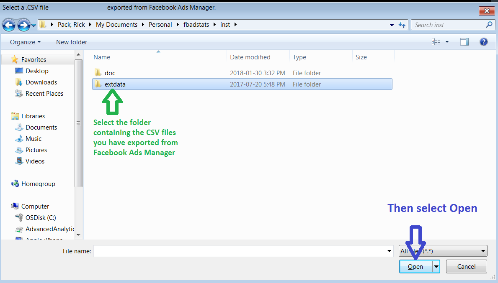
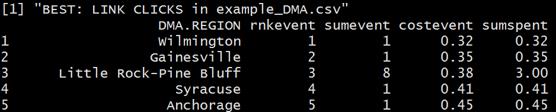

```{r set-options, include=FALSE}
knitr::opts_chunk$set(collapse = TRUE, comment = "#>", fig.width = 7, fig.height = 7, fig.align = "center")
## save current width option, set to a large value, then resets back at end of code
curwid <- getOption('width')
options(width = 750)
```

The `FBadGstats` function aggregates across all of the Facebook (FB) ads performance data one provides from FB Ads Manager and indicates the best and worst performers per subgroup / breakdown group, as well as the best / worst Campaign, Ad Set, or Ad depending on what is found in the file. *Disclaimer: This function and the entire `FBadstats` package are not supported or endorsed by Facebook, Inc. Only the user is responsible for its use.*

# How to use `FBadGstats`
## Easiest use - select a file or folder
The easiest use is available only in Windows. Call the function, navigate to your exported CSV file and then select it. The default parameters may give you all you need.  
Background: Running the function without a `filerd` parameter will prompt you with a window in which you choose your CSV file, and then the default parameters for `FBadGstats` are used.
### Call the function
```{r packageload, message=FALSE, echo=FALSE}
## load the package
library(FBadstats)
```
```{r no_param, message=FALSE, eval=FALSE}
FBadGstats()
```

### Select your file


### Use the output


[Windows-Only] Running the function with `choosedir` set to TRUE prompts you with a window in which you can select a folder and `FBadGstats` runs on every .CSV file in that directory / folder.
```{r choosedir_param, message=FALSE, eval=FALSE}
FBadGstats(choosedir=TRUE)
```

## Advanced use - use one of the >10 parameters
We will first use the included **example_PerfClk_AgeGender** CSV file that represents exported data from ads dedicated to acquiring "Leads" (email addresses for potential customers AKA "an email funnel").

The "PerfClk" in the name indicates that the "Performance and Clicks" view was used in Ads Manager at the time of the export, which is the best view to first try - others may fail. I will add to the error messages over time so one better understands why a view failed, and a view may succeed as the function evolves. The "AgeGender" in the filename expresses that the selected breakdown was a *combination* of age and gender.

### Show only the table output (not a graph and its complementing table):
Setting the `tblout` parameter to BOTH causes the best and worst performers to appear in the table
**Note:** The filerd parameter, if used, must have the full path to a CSV file with slashes, not backslashes (e.g., `filerd` = *'c:/users/Users/RickPack/Documents/R/LeadData.csv'*).
    Example files included with the `FBadstats` package are exceptions.
    
### now call the function and provide parameters as desired
```{r tbloutboth_param, message=FALSE, eval=FALSE}
FBadGstats(filerd = "example_PerfClk_AgeGender.csv", grphout = FALSE, tblout = "BOTH")
```

### Show only the best breakdown groups in the table:
**Note:** `FBadGstats` graphs *always* show only the best breakdown groups.
```{r graphbest_param}
FBadGstats(filerd = "example_PerfClk_AgeGender.csv", grphout = TRUE, tblout = "BEST")
```

### Parameter highlight: `spentlim`
I enjoy exploring DMAs (Designated Market Areas) as targets for advertising. Let's look at the worst performers.
```{r spentlim} 
FBadGstats(filerd = "example_DMA.csv", grphout = FALSE, tblout = "WORST")
```
Look at all the regions with small amounts spent on them like #19 *Dayton* ($1.88). Perhaps not enough money has been spent in those regions, at least yet, to make their exclusion worthwhile.

We can use the `spentlim` parameter to specify a minimum amount spent and therefore capture the DMAs that are proportionally more wasteful. By setting the minimum spent to $5, DMAs including *Dayton* no longer appear and *New York* rises to the second worst slot.
```{r spentlim5} 
FBadGstats(filerd = "example_DMA.csv", grphout = FALSE, tblout = "WORST", spentlim = 5)
```
### Parameter highlight: `printrow`, `minevent`, `sumvar`
Finally, the 15 worst with respect to *WEBSITE.REGISTRATIONS.COMPLETED* using the `sumvar` parameter. Notice that the entire column entry does not need to be typed for this case-insensitive parameter. "Regist" was sufficient.
No limit on the amount spent (i.e., no `minspent` paramter in function call) but at least two *WEBSITE.REGISTRATIONS.COMPLETED* must have occurred:
```{r moreparams} 
FBadGstats(filerd = "example_DMA.csv", grphout = FALSE, tblout = "WORST", sumvar = "Regist", printrow = 15, minevent = 2)
```
```{r restoreoptions, echo=FALSE, cache=FALSE}
options(width = curwid)
```
